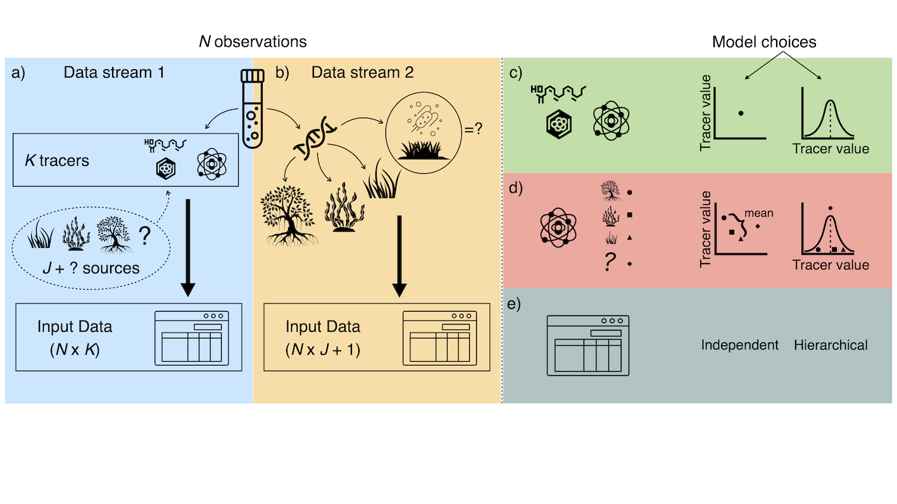

<!-- README.md is generated from README.Rmd. Please edit that file -->

```{r, include = FALSE}
stopifnot(require(knitr))
options(width = 90)
knitr::opts_chunk$set(
  collapse = TRUE,
  comment = "#>",
  fig.path = "man/figures/",
  out.width = "100%"
)
```

```{r, echo = FALSE}
version <- as.vector(read.dcf("DESCRIPTION")[, "Version"])
version <- gsub("-", ".", version)
```

# mixmustr 

<!-- badges: start -->
[](https://lifecycle.r-lib.org/articles/stages.html)
[](https://choosealicense.com/)
[](https://github.com/open-AIMS/mixmustr/issues/new)

<!-- badges: end -->

## Overview

`mixmustr` is a flexible Bayesian mixture model package written in the probabilistic programming language [Stan](https://mc-stan.org/) for [R](https://www.r-project.org/) which estimates source mixing proportions by incorporating simultaneous likelihood evaluation from two independent data streams collected from the mixture of interest (Fig. 1a–b): one obtained from chemical tracers/biomarkers (i.e., a single tracer measurement per observation, e.g., from stable isotopes and fatty acids), and another yielding source composition (e.g., based on eDNA). MixMustR also allows for the estimation of an additional, unsampled source component. We evaluate MixMustR models abilities to recover original source mixing proportions using two synthetic mixture datasets anchored to empirical values for a range of plant carbon sources in marine soils. Some of our model choices build on the widely-used [MixSIAR](https://github.com/brianstock/MixSIAR). MixMustR should have wide applicability in ecological studies, particularly given the growing usage and availability of eDNA and metabarcoding methods to understand carbon source-sink dynamics ([Queirós et al. 2019](https://esajournals.onlinelibrary.wiley.com/doi/10.1002/ecm.1366)) as well as trophic interactions ([Hoenig et al. 2022](https://onlinelibrary.wiley.com/doi/abs/10.1111/mec.16688)).



**Figure 1:** MixMustR input data and framework. MixMustR relies on two independent data streams that are collected from the same *N* samples. a) the first stream (blue panel) is characterised by the canonical chemical tracer/biomarker (e.g., stable isotope, fatty acid) dataset, whereby a mixture measurement is obtained for every *k*^th^ tracer and *n*^th^ observation. The original sources of such mixtures are unknown, and based on domain knowledge researchers often assume that they come from *J* likely sources—here represented by hypothetical autotrophic carbon sources within the dashed bubble. However, there is a possibility that at least one additional source (the question mark) is not comprised in the *J* set of sources. b) The second stream (yellow panel) is yielded by community composition datasets which can be transformed to mixing proportions, such as those obtained via eDNA or metabarcoding techniques. This stream of information can reveal mixture sources beyond the original *J* sources considered by researchers, and MixMustR leverages that knowledge by combining those additional sources into one single "unsampled" source, which would amount to the question mark in the first data stream. Given these data, the user can choose among eight model variants based on three choices (c—e).

## Installation

The current development version can be downloaded from GitHub via

```{r eval=FALSE}
if (!requireNamespace("remotes")) {
  install.packages("remotes")
}
remotes::install_github("open-aims/mixmustr", ref = "dev")
```

Because `mixmustr` is based on [Stan](https://mc-stan.org/), a C++
compiler is required. The program
[Rtools](https://cran.r-project.org/bin/windows/Rtools/) comes with a C++
compiler for Windows. On Mac, you should install Xcode. See the prerequisites
section on this
[link](https://github.com/stan-dev/rstan/wiki/RStan-Getting-Started)
for further instructions on how to get the compilers running.

## Usage

```{r eval=FALSE}
library(mixmustr)
options(mc.cores = parallel::detectCores())
rstan::rstan_options(auto_write = TRUE)
tracer_pars <- wrangle_tracer_pars(bcs_si, bcs_fa)
mu_tab <- tracer_pars$mu_tab
sig_tab <- tracer_pars$sig_tab
model_fits <- run_all_mixmustr_models(
  mixmustr_models, synthetic_df_convergent, mu_tab, sig_tab, sigma_ln_rho = 0.1,
  iter = 1e4, warmup = 5e3, chains = 4, cores = 4
)
```

## Further Information

`mixmustr` is provided by the
[Australian Institute of Marine Science](https://www.aims.gov.au/) under the
MIT License([MIT](https://opensource.org/license/mit/)).
