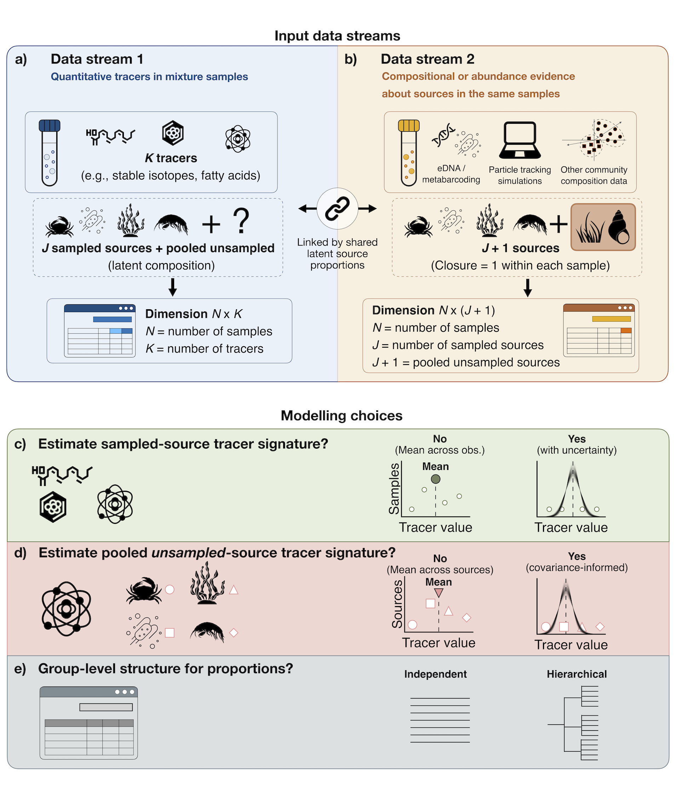
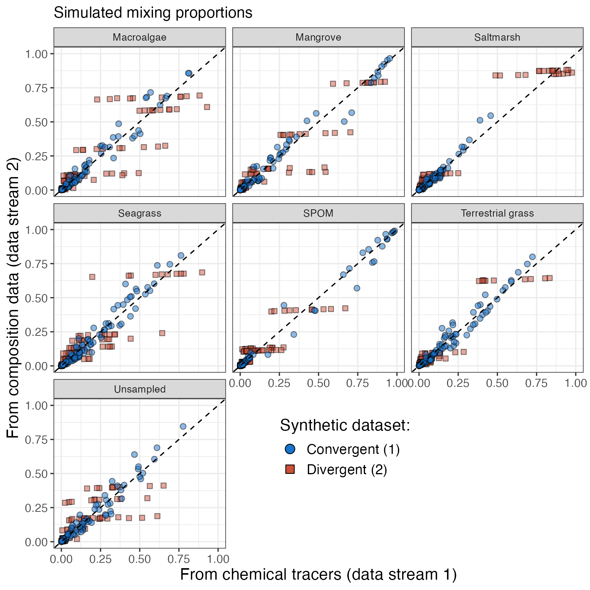

<!-- README.md is generated from README.Rmd. Please edit that file -->

```{r, include = FALSE}
stopifnot(require(knitr))
options(width = 90)
knitr::opts_chunk$set(
  collapse = TRUE,
  comment = "#>",
  fig.path = "man/figures/",
  out.width = "100%"
)
```

```{r, echo = FALSE}
version <- as.vector(read.dcf("DESCRIPTION")[, "Version"])
version <- gsub("-", ".", version)
```

# MixMustR 

<!-- badges: start -->
[](https://lifecycle.r-lib.org/articles/stages.html)
[](https://github.com/open-AIMS/MixMustR/actions/workflows/R-CMD-check.yaml)
[](https://app.codecov.io/gh/open-AIMS/MixMustR)
[](https://choosealicense.com/)
[](https://github.com/open-AIMS/MixMustR/issues/new)

<!-- badges: end -->

## Overview

`MixMustR` is a flexible Bayesian mixture model package written in the probabilistic programming language [Stan](https://mc-stan.org/) for [R](https://www.r-project.org/). It estimates source mixing proportions by incorporating simultaneous likelihood evaluation from two independent data streams collected from the mixture of interest (Fig. 1a–b): one obtained from chemical tracers/biomarkers (i.e., a single tracer measurement per observation, e.g., from stable isotopes and fatty acids), and another yielding source composition (e.g., based on eDNA metabarcoding, particle-tracking simulations, or other community-composition data). `MixMustR` also allows for the estimation of an additional, unsampled source component to partially relax the assumption that the mixing proportions from all samples sources should sum up to 1. `MixMustR` should have wide applicability in ecological studies, particularly given the growing usage and availability of multiple tracers spanning traditional stable isotopes and eDNA to understand carbon source-sink dynamics ([Reef *et al.* 2018](https://aslopubs.onlinelibrary.wiley.com/doi/10.1002/lno.10499), [Ortega *et al.* 2020](https://aslopubs.onlinelibrary.wiley.com/doi/10.1002/lno.11579), [Queirós *et al.* 2019](https://esajournals.onlinelibrary.wiley.com/doi/10.1002/ecm.1366)), and a mixture of stables isotope, fatty acids and eDNA to unravel trophic interactions (e.g., [Nielsen *et al.* 2017](https://besjournals.onlinelibrary.wiley.com/doi/10.1111/2041-210X.12869), [Hoenig *et al.* 2022](https://onlinelibrary.wiley.com/doi/abs/10.1111/mec.16688)).

<p align="center">
  
</p>

**Figure 1:** **`MixMustR` input data streams and modelling framework.** MixMustR integrates two complementary data streams from the same $N$ mixture samples, linked through shared latent source proportions. **a)** Data stream 1 comprises quantitative measurements of $K$ chemical tracers or biomarkers (e.g., stable isotopes, fatty acids) as an $N \times K$ matrix; each mixture may include at least $J$ underlying sampled sources. **b)** Data stream 2 provides compositional or abundance evidence that can reveal contributions beyond the $J$ sampled sources; these are pooled into the same unsampled-source category, yielding an $N \times (J+1)$ structure whose proportions sum to one per sample. Given these streams, users choose among eight model variants defined by three binary choices: \textbf{c)} sampled-source signatures fixed or estimated with propagated uncertainty; \textbf{d)} the pooled unsampled-source signature fixed at the sampled-source mean or estimated via a covariance-informed prior; \textbf{e)} independent or hierarchical (grouped) source proportions. Icons from the [Noun Project](https://thenounproject.com) (all [CC BY 3.0](https://creativecommons.org/licenses/by/3.0/deed.en)): fatty acid by Template, DNA by BomSymbols, stable isotope by Lars Meiertoberens, plankton by Tamrin, terrestrial grass by Luis Prado, seaweed by mangunkarsa. Icons from [PhyloPic](https://www.phylopic.org/): gastropod shell by Tauana Cunha ([CC0 1.0](https://creativecommons.org/publicdomain/zero/1.0/deed.en)), amphipod by T. Michael Keesey ([CC BY-SA 3.0](https://creativecommons.org/licenses/by-sa/3.0/deed.en)). All other icons by the authors.

The publication describing in full the statistical models in `MixMustR` can be found in an [accompanying repository](https://github.com/open-AIMS/MixMustR_paper).

## Model variants

`MixMustR` currently allows for eight model variants which result from three user-driven binary choices: 1) should the model only ingest the mean sampled-source tracer signatures (equivalent to "residual-only error" structure of the widely-used [MixSIAR](https://github.com/brianstock/MixSIAR)) or should it incorporate their uncertainty based on user-provided mean, standard deviation and sample size information (equivalent to "process error" structure of MixSIAR, Fig. 1c); 2) should the unsampled-source tracer signatures be fixed at the mean across all sampled sources, or should they rather be estimated jointly across tracers using a covariance-informed prior derived from the sampled-source tracer signatures? (Fig. 1d) and 3) should all observations be treated as independent or should the model include a hierarchical grouping structure? (Fig. 1e).

## Synthetic datasets

`MixMustR` comes with two synthetic mixture datasets, `synthetic_df_convergent` and `synthetic_df_divergent`. Both are anchored to empirical values of stable isotopes and fatty acids for a range of plant carbon sources in marine soils. They are hierarchical in structure, simulating 100 mixture observations arranged in 10 groups of 10 (identical between both datasets), following the factorial simulation design described in the accompanying manuscript. They differ in their discrepancy between the underlying mixing proportions between data streams 1 and 2, with `synthetic_df_convergent` exhibiting little difference, whereas `synthetic_df_divergent` exhibits larger difference:

```{r eval=FALSE}
library(MixMustR)
mus <- tracer_parameters$mus
compare_mixing_proportions(synthetic_df_divergent, synthetic_df_convergent, mus)
```

<p align="center">
  
</p>

Although in real applications the user is unlikely to know the underlying mixing proportion of data stream 1, these synthetic datasets are useful to test the ability of the model variants (see above) to retrieve the underlying mixture proportions, and the package offers simple summary and visualisation functions for diagnostics.

## Installation

The current development version can be downloaded from GitHub via

```{r eval=FALSE}
if (!requireNamespace("remotes")) {
  install.packages("remotes")
}
remotes::install_github("open-AIMS/MixMustR", ref = "dev")
```

Otherwise install the stable version via

```{r eval=FALSE}
if (!requireNamespace("remotes")) {
  install.packages("remotes")
}
remotes::install_github("open-AIMS/MixMustR", ref = "main")
```

Because `MixMustR` is based on [Stan](https://mc-stan.org/), a C++
compiler is required. See the prerequisites
section on this
[link](https://github.com/stan-dev/rstan/wiki/RStan-Getting-Started)
for further instructions on how to get the compilers running.

## Usage

See package documentation and [online vignettes](https://open-AIMS.github.io/MixMustR/articles/introduction.html) for full explanation of expected structure of input variables, as well as how to decide on the measurement error/confidence for data stream 2.

```{r eval=FALSE}
library(MixMustR)
options(mc.cores = parallel::detectCores())
rstan::rstan_options(auto_write = TRUE)
# As an example, we pick mixmustr_models[8, ] because it runs quicker. It is
# non-hierarchical and does not estimate the sampled tracer signatures,
# though it does estimate the unsampled signature. `sigma_ln_rho = 1` is a
# conservative choice that places weak confidence in the estimates of data
# stream 2.
model_fits <- run_mixmustr_models(
  mixmustr_models[8, ], synthetic_df_convergent, tracer_parameters,
  sigma_ln_rho = 1, iter = 1e4, warmup = 5e3, chains = 4, cores = 4
)
# then visualise a particular output
make_post_prop_long(model_fits[[1]]$model, tracer_parameters$mus,
                    synthetic_df_convergent, target = "df_stream_2", n = 1) |>
  plot_multiple_faceted_scatter_avg() +
  theme(legend.position = "none") +
  labs(y = "Observed (simulated) from composition data (data stream 2)",
       title = "Model fit performance mixing proportions",
       subtitle = "Synthetic dataset of high agreement")
```

## Further Information

`MixMustR` is provided by the
[Australian Institute of Marine Science](https://www.aims.gov.au/) under the
MIT License ([MIT](https://opensource.org/license/mit)).
