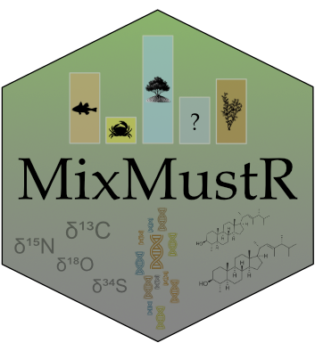

<!-- README.md is generated from README.Rmd. Please edit that file -->

```{r, include = FALSE}
stopifnot(require(knitr))
options(width = 90)
knitr::opts_chunk$set(
  collapse = TRUE,
  comment = "#>",
  fig.path = "man/figures/",
  out.width = "100%"
)
```

```{r, echo = FALSE}
version <- as.vector(read.dcf("DESCRIPTION")[, "Version"])
version <- gsub("-", ".", version)
```

# MixMustR 

<!-- badges: start -->
[](https://lifecycle.r-lib.org/articles/stages.html)
[](https://github.com/open-aims/MixMustR/actions/workflows/R-CMD-check.yaml)
[](https://choosealicense.com/)
[](https://github.com/open-AIMS/MixMustR/issues/new)

<!-- badges: end -->

## Overview

`MixMustR` is a flexible Bayesian mixture model package written in the probabilistic programming language [Stan](https://mc-stan.org/) for [R](https://www.r-project.org/). It estimates source mixing proportions by incorporating simultaneous likelihood evaluation from two independent data streams collected from the mixture of interest (Fig. 1a–b): one obtained from chemical tracers/biomarkers (i.e., a single tracer measurement per observation, e.g., from stable isotopes and fatty acids), and another yielding source composition (e.g., based on eDNA). `MixMustR` also allows for the estimation of an additional, unsampled source component to partially relax the assumption that the mixing proportions from all samples sources should sum up to 1. `MixMustR` should have wide applicability in ecological studies, particularly given the growing usage and availability of multiple tracers spanning traditional stable isotopes and eDNA to understand carbon source-sink dynamics ([Reef *et al.* 2018](https://aslopubs.onlinelibrary.wiley.com/doi/10.1002/lno.10499), [Ortega *et al.* 2020](https://aslopubs.onlinelibrary.wiley.com/doi/10.1002/lno.11579), [Queirós *et al.* 2019](https://esajournals.onlinelibrary.wiley.com/doi/10.1002/ecm.1366)), and a mixture of stables isotope, fatty acids and eDNA to unravel trophic interactions (e.g., [Nielsen *et al.* 2017](https://besjournals.onlinelibrary.wiley.com/doi/10.1111/2041-210X.12869), [Hoenig *et al.* 2022](https://onlinelibrary.wiley.com/doi/abs/10.1111/mec.16688)).

<p align="center">
  
</p>

**Figure 1:** `MixMustR` input data and framework. `MixMustR` relies on two independent data streams that are collected from the same *N* samples. a) the first stream (blue panel) is characterised by the canonical chemical tracer/biomarker (e.g., stable isotope, fatty acid) dataset, whereby a mixture measurement is obtained for every *k*^th^ tracer and *n*^th^ observation. The original sources of such mixtures are unknown, and based on domain knowledge researchers often assume that they come from *J* likely sources—here represented by hypothetical autotrophic carbon sources within the dashed bubble. However, there is a possibility that at least one additional source (the question mark) is not comprised in the *J* set of sources. b) The second stream (yellow panel) is yielded by community composition datasets which can be transformed to mixing proportions, such as those obtained via eDNA or metabarcoding techniques. This stream of information can reveal mixture sources beyond the original *J* sources considered by researchers, and `MixMustR` leverages that information by combining those additional sources into one single *unsampled* source, which would amount to the question mark in the first data stream. Given these data, the user can choose among eight model variants based on three choices (c—e, see below for more explanations).

## Model variants

`MixMustR` currently allows for eight model variants which result from three user-driven binary choices: 1) should the model only ingest the mean sampled-source tracer signatures (equivalent to "residual-only error" structure of the widely-used [MixSIAR](https://github.com/brianstock/MixSIAR)) or should it incorporate their uncertainty based on user-provided mean, variance and sample size information (equivalent to "process error" structure of MixSIAR, Fig. 1c); 2) should the unsampled-source tracer signatures be fixed at the mean across all sampled sources, or should they rather be estimated based on a prior informed by the mean and variance across the sampled tracer signatures? (Fig. 1d) and 3) should all observations be treated as independent or should the model include a hierarchical grouping structure? (Fig. 1e).

## Synthetic datasets

`MixMustR` comes with two synthetic mixture datasets, `synthetic_df_convergent` and `synthetic_df_divergent`. Both are anchored to empirical values of stable isotopes and fatty acids for a range of plant carbon sources in marine soils. They are hierarchical in structure and simulate an unbalanced design (identical between both datasets) that would be typical of an ecological field sampling design. They differ in their discrepancy between the underlying mixing proportions between data streams 1 and 2, with `synthetic_df_convergent` exhibiting little difference, whereas `synthetic_df_divergent` exhibits larger difference:

```{r eval=FALSE}
library(MixMustR)
mus <- tracer_parameters$mus
compare_mixing_proportions(synthetic_df_divergent, synthetic_df_convergent, mus)
```

<p align="center">
  
</p>

Although in real applications the user is unlikely to know the underlying mixing proportion of data stream 1, these synthetic datasets are useful to test the ability of the model variants (see above) to retrieve the underlying mixture proportions, and the package offers simple summary and visualisation functions for diagnostics.

## Installation

The current development version can be downloaded from GitHub via

```{r eval=FALSE}
if (!requireNamespace("remotes")) {
  install.packages("remotes")
}
remotes::install_github("open-aims/MixMustR", ref = "main")
```

Because `MixMustR` is based on [Stan](https://mc-stan.org/), a C++
compiler is required. The program
[Rtools](https://cran.r-project.org/bin/windows/Rtools/) comes with a C++
compiler for Windows. On Mac, you should install Xcode. See the prerequisites
section on this
[link](https://github.com/stan-dev/rstan/wiki/RStan-Getting-Started)
for further instructions on how to get the compilers running.

## Usage

See package documentation and online vignettes for full explanation of expected structure of input variables.

```{r eval=FALSE}
library(MixMustR)
options(mc.cores = parallel::detectCores())
rstan::rstan_options(auto_write = TRUE)
# As an example, we pick mixmustr_models[6, ] because it runs quickest. It is
# non-hierarchical and does not estimate (un)sampled tracer signatures.
model_fits <- run_mixmustr_models(
  mixmustr_models[6, ], synthetic_df_convergent, tracer_parameters,
  sigma_ln_rho = 0.1, iter = 1e4, warmup = 5e3, chains = 4, cores = 4
)
# then visualise a particular output
make_post_prop_long(model_fits[[1]]$model, tracer_parameters$mus,
                    synthetic_df_convergent, target = "df_stream_2", n = 1) |>
  plot_multiple_faceted_scatter_avg() +
  theme(legend.position = "none") +
  labs(y = "Observed (simulated) from eDNA (data stream 2)",
       title = "Model fit performance mixing proportions",
       subtitle = "Synthetic dataset of high agreement")
```

## Further Information

`MixMustR` is provided by the
[Australian Institute of Marine Science](https://www.aims.gov.au/) under the
MIT License ([MIT](https://opensource.org/license/mit)).
