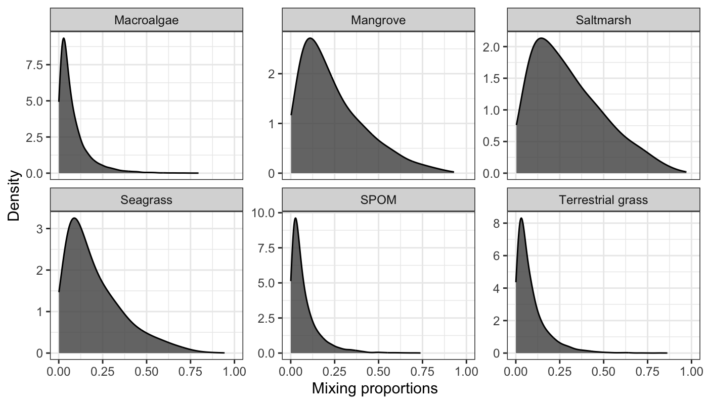

# Overview

`MixMustR` is a flexible Bayesian mixture model package written in the probabilistic programming language [Stan](https://mc-stan.org/) for [R](https://www.r-project.org/). It estimates source mixing proportions by incorporating simultaneous likelihood evaluation from two independent data streams collected from the mixture of interest:

1. **Chemical tracers/biomarkers** (e.g., stable isotopes, fatty acids).
2. **Source composition** (e.g., based on eDNA or metabarcoding).

`MixMustR` also allows for the estimation of an additional, unsampled source component to partially relax the assumption that the mixing proportions from all sampled sources should sum to 1. This makes it particularly useful in ecological studies, such as understanding carbon source-sink dynamics or trophic interactions.

<p align="center">
  
</p>

**Figure 1:** `MixMustR` input data and framework.

This vignette will walk you through the basic usage of `MixMustR`, covering:

* Preparing input data
* Running multiple model configurations
* Visualizing model fit

## Model Variants

`MixMustR` provides eight model variants based on three user-driven binary choices:

1. **Tracer signature error structure**:
   - Residual-only error (similar to MixSIAR).
   - Process error (incorporates uncertainty in tracer signatures).

2. **Unsampled-source tracer signatures**:
   - Fixed at the mean across sampled sources.
   - Estimated using a prior informed by sampled tracer signatures.

3. **Observation independence**:
   - Independent observations.
   - Hierarchical grouping structure.

The combination of these three choices is pre-packaged in `MixMustR` via the data frame `mixmustr_models`.

## Synthetic Datasets in `MixMustR`

The `MixMustR` package includes two synthetic mixture datasets, `synthetic_df_convergent` and `synthetic_df_divergent`, designed for testing and validation purposes. Both datasets are anchored to empirical values of stable isotopes and fatty acids from plant carbon sources in marine soils and simulate a hierarchical, unbalanced ecological field sampling design.

- **`synthetic_df_convergent`**: Exhibits minimal differences in the underlying mixing proportions between data streams 1 and 2.
- **`synthetic_df_divergent`**: Exhibits significant differences in the underlying mixing proportions between data streams 1 and 2.

Each dataset is a list containing three data frames:

1. **`df_stream_1`**: Simulated mixture data for the first stream, including tracer estimates. Its size is N observations by K tracers. It also contains an additional column named `group`, which captures the grouping structure of this synthetic dataset. This group column is not mandatory, e.g., in case all observations are independent.

2. **`df_stream_2`**: Synthetic proportions for the second stream, with a column for each source. Its size is N observations by J sources. At the observation/row level, the sum should be constrained between 0 and 1. Like `df_stream_1`, it also contains an additional column named `group`, which captures the grouping structure of this synthetic dataset.

3. **`stream_1_props`**: Synthetic proportions for the first stream. This data frame is not a mandatory requirement to run models in `MixMustR`, it is only exported and used for testing purposes.

These datasets and their underlying simulated synthetic proportions were generated using internal non-exported functions, combining data from stable isotopes (`bcs_si`) and fatty acids (`bcs_fa`). These synthetic datasets are valuable for evaluating the ability of model variants to retrieve underlying mixture proportions, and `MixMustR` offers diagnostic tools available for summary and visualization.

## Setup

We begin by loading the package and setting options for parallel computing and Stan:


``` r
library(MixMustR)
rstan::rstan_options(auto_write = TRUE)
options(mc.cores = parallel::detectCores())
```

---

## Step 1: Prepare Tracer Parameters

We'll assume you have access to source tracer summaries—mean (`mus`), standard deviation (`sigmas`) and sample size (`ns`) values for each source. These should be combined into a named list, and `MixMustR` provides an example list called `tracer_parameters`.

These are required to inform the model about each source's chemical signatures and the variability around them.

---

## Step 2: Run the Models

The core function to run models is `run_mixmustr_models()`. This function allows you to run multiple models defined in the built-in `mixmustr_models` data frame. In addition to the model(s) of choice, the user also needs the input data frame (here we use the synthetic dataset `synthetic_df_convergent`), and declare their level of confidence in the input mixing proportions of data stream 2 via the parameter `sigma_ln_rho`. `MixMustR` transforms the mixing proportions from data stream 2 before running a model, and `sigma_ln_rho` captures the measurement error on the latent log-transformed mixing proportion, and in practice can be interpreted as the degree of confidence a user has in each element of log-transformed mixing proportions from data stream 2.


``` r
model_fits <- run_mixmustr_models(
  mixmustr_models[6, ], synthetic_df_convergent, tracer_parameters,
  sigma_ln_rho = 1, iter = 1e4, warmup = 5e3, chains = 4, cores = 1
)
```

Importantly, MixMustR ingests that confidence at the *observation and source* level. If the user inputs a single numeric value for `sigma_ln_rho` as above, that will be applied across all observations in data stream 2. Choosing the appropriate value for the uncertainty around data stream 2 is not trivial. Therefore, the `MixMustR` package offers a simple tool which plots the expected variability in mixing proportion as a function of an input vector of mixing proportions from data stream 2 (one from each source), and their respective degrees of confidence or measurement error. Although the function does not inform the user what the expected uncertainty for each source and observation should be (what has to come from expect knowledge), it does allow the user to fine tune `sigma_ln_rho` until the appropriate variability in input mixing proportions is achieved. As an example, we show the expected variability in mixing proportions that would result from the value of 1 above:


``` r
# An observation from input mixing proportion in data stream 2, remove the group
#  column.
pis <- unlist(synthetic_df_convergent$df_stream_2[2, -1])
# Then for each create a value for their measurement error
sigma_ln_rho <- rep(1, length(pis))
# Visualize the potential parameter resulting from the chosen uncertainty
MixMustR::evaluate_uncertainty(pis, sigma_ln_rho)$plot
```

<p align="center">
  
</p>


So a decent amount of variation is allowed with this value. This could reflect, for example, weak confidence in the mixing proportion observations in data stream 2.

### Behind the Scenes

This function:

* Uses the tracer means (`mus`) and standard deviations (`sigmas`)
* Reads your observed data (`synthetic_df_convergent`)
* Applies each model configuration in `mixmustr_models`
* Internally calls `mixmustr_wrangle_input()` to prepare each dataset for Stan
* Returns a list of results, one per model configuration

---

## Step 3: Visualize Model Fit

Once a model is fit, you can visualize the performance using the built-in plotting tools.


``` r
library(ggplot2)
mus <- tracer_parameters$mus
make_post_prop_long(
  model_fits[[1]]$model, mus, synthetic_df_convergent, target = "df_stream_2",
  n = 1
) |>
  plot_multiple_faceted_scatter_avg() +
  theme(legend.position = "none") +
  labs(
    y = "Observed (simulated) from eDNA (data stream 2)",
    title = "Model fit performance mixing proportions",
    subtitle = "Synthetic dataset of high agreement"
  )
```

<p align="center">
  
</p>


This plot compares observed vs. predicted mixing proportions for data stream 2, helping you assess how well the model captures the underlying signal. You can also explore how the model estimates compare to the stream 2 benchmark using Bayesian R^2^ ([Gelman *et al.*, 2019](http://doi.org/10.1080/00031305.2018.1549100)):


``` r
mixmustr_bayes_R2(
  model_fits[[1]]$model, summary = TRUE,
  data_streams_list = synthetic_df_convergent, target = "df_stream_2",
  order_ref = tracer_parameters$mus$source
)
#>              Source mean 2.5%HDI 97.5%HDI
#> 1        Macroalgae 0.57    0.48     0.66
#> 2          Mangrove 0.61    0.52     0.70
#> 3         Saltmarsh 0.64    0.60     0.69
#> 4          Seagrass 0.61    0.57     0.66
#> 5              SPOM 0.53    0.40     0.67
#> 6 Terrestrial grass 0.59    0.49     0.68
#> 7         Unsampled 0.61    0.57     0.66
```

---

## Recap: Using `MixMustR`

Here's a quick summary of how to use `MixMustR` effectively:

1. **Prepare Input Data**:

   * `df_stream_1`: Observed data (optionally with group labels)
   * `df_stream_2`: Known mixing proportions (e.g., from eDNA)

2. **Define Tracer Summaries**:

   * `mus`: Mean tracer values per source
   * `sigmas`: Standard deviation per tracer per source

3. **Run Model Configurations**:

   * Use `run_mixmustr_models()` with the default or custom configurations
   * Adjust Stan settings (iterations, chains, etc.) as needed

4. **Visualize Results**:

   * Use `make_post_prop_long()` and plotting functions to assess fit
   * Use `mixmustr_bayes_R2()` to create a table of Bayesian R^2^ values

---

## Optional: Custom Input Creation

If you want more control, you can use `mixmustr_wrangle_input()` directly to prepare the Stan input list. This is helpful if you're modifying the Stan code or working outside the wrapper functions.

---

## References

* Stock, B. C., Semmens, B. X. (2016). MixSIAR GUI User Manual. [https://github.com/brianstock/MixSIAR](https://github.com/brianstock/MixSIAR)

